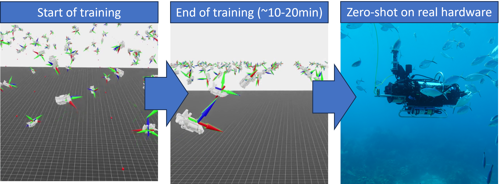

# Learning to Swim: Reinforcement Learning for 6-DOF Control of Thruster-driven Autonomous Underwater Vehicles



Links: [arxiv paper](https://arxiv.org/abs/2410.00120)

**Note: you are recommended to not be in a conda environment when setting up and running Isaac Sim.** If you are in an environment, you can run:
```
conda deactivate
```

To install, requires IsaacSim v4.5.0 and IsaacLab v2.0.0:
- Install IsaacSim v4.5.0 (https://docs.isaacsim.omniverse.nvidia.com/4.5.0/installation/download.html)
  - Download and unzip the archived binaries into a new folder (i.e. "IsaacSim")

Before installing Isaac Lab, check your operating system version (https://isaac-sim.github.io/IsaacLab/main/source/setup/installation/index.html)
- Install IsaacLab v2.0.0, for Ubuntu 20.04 (https://isaac-sim.github.io/IsaacLab/main/source/setup/installation/binaries_installation.html#installing-isaac-lab)
  ```
  git clone https://github.com/isaac-sim/IsaacLab.git
  ```

- Soft link Isaac lab and Isaac sim 
  ```
  cd <IsaacLab_Path> 
  ln -s <IsaacSim_Path> _isaac_sim
  ```

Install dependencies (assuming Ubuntu here):
```
# these dependency are needed by robomimic which is not available on Windows
sudo apt install cmake build-essential
```

Finish installing Isaac Lab:
```
<IsaacSim_Path>/kit/python/bin/python3 -m pip install --upgrade pip
./isaaclab.sh --install # or "./isaaclab.sh -i"
```

Verify the installation worked!
```
# Option 1: Using the isaaclab.sh executable
# note: this works for both the bundled python and the virtual environment
./isaaclab.sh -p scripts/tutorials/00_sim/create_empty.py
```

- Clone this repository:

  - If using docker container:
  ```
  cd <IsaacLab_Path>/source/isaaclab_tasks/isaaclab_tasks/direct/isaac-warpauv-env
  git clone https://github.com/warplab/isaac-auv-env.git
  ```

  - If using workstation install:
  ```
  git clone https://github.com/warplab/isaac-auv-env.git
  cd <IsaacLab_Path>/source/isaaclab_tasks/isaaclab_tasks/direct/
  ln -s <isaac-auv-env_Path> isaac-auv-env
  ```
  (Note: if using a workstation install, you can follow the docker instructions as well, but the soft link seems cleaner for local development. Docker is painful when working with links)

To run training:
```
./isaaclab.sh -p scripts/workflows/rsl_rl/train.py --task Isaac-WarpAUV-Direct-v1 --num_envs 2048
```

Additional notes:

 - To import a URDF file into USD format for IsaacLab, you can first export a ROS xacro file into URDF, and then import that URDF file into the IsaacSim URDFImporter Workflow.

 ```
 rosrun xacro xacro --inorder -o <output.urdf> <input.xacro>
 ./isaaclab.sh -p scripts/tools/convert_urdf.py  <input_urdf> <output_usd> --merge-joints --make-instance
 ```

 - Generally converges in about 400 iterations with 2048 environments and achieves mean total reward ~95-100. Lowering action penalty often helps if there are issues with convergence.

To cite:
```
@inproceedings{caiLearningSwimReinforcement2025,
  title = {Learning to {{Swim}}: {{Reinforcement Learning}} for 6-{{DOF Control}} of {{Thruster-driven Autonomous Underwater Vehicles}}},
  booktitle = {2025 {{IEEE International Conference}} on {{Robotics}} and {{Automation}} ({{ICRA}})},
  author = {Cai, Levi and Chang, Kevin and Girdhar, Yogesh},
  date = {2025},
  url = {https://arxiv.org/abs/2410.00120},
  eventtitle = {2025 {{IEEE International Conference}} on {{Robotics}} and {{Automation}} ({{ICRA}})}
}

```

**Migration from 4.0 to 4.5 notes** <br/>
First you must rename the API references (https://isaac-sim.github.io/IsaacLab/main/source/refs/migration.html). There is a python script linked on that site that will do this for you; set the correct directory within the script! <br/>
Then, I needed to explicitly configure the `obervation_space`, `action_space`, and `state_space` variables:
```[Python]
observation_space: gym.spaces.Space = gym.spaces.Box(low=-np.inf, high=np.inf, shape=(17,), dtype=np.float64)
action_space: gym.spaces.Space = gym.spaces.Box(low=-1.0, high=1.0, shape=(6,), dtype=np.float64)
state_space: gym.spaces.Space = gym.spaces.Box(low=-np.inf, high=np.inf, shape=(17,), dtype=np.float64)
```

Finally, I had to set `articulation_enabled=False` in `assets/warpauv.py`:
```
import isaaclab.sim as sim_utils

from isaaclab.assets import RigidObjectCfg

import os
USD_PATH = os.path.join(os.path.dirname(__file__), "../data/warpauv/warpauv.usd")

WARPAUV_CFG = RigidObjectCfg(
    prim_path="{ENV_REGEX_NS}/Robot",
    spawn=sim_utils.UsdFileCfg(
        usd_path=USD_PATH,
        rigid_props=sim_utils.RigidBodyPropertiesCfg(
            disable_gravity=False,
            max_depenetration_velocity=10.0,
            enable_gyroscopic_forces=True,
        ),
        articulation_props=sim_utils.ArticulationRootPropertiesCfg(
            articulation_enabled=False,
        ),

        copy_from_source=False,
    ),
    init_state=RigidObjectCfg.InitialStateCfg(
        pos=(0.0, 0.0, 5),
    )
)
"""Configuration for the WarpAUV."""
```
